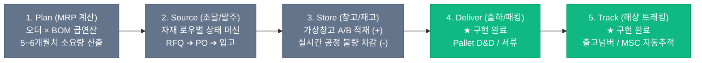

# 🚀 APEX SCM Suite 프로젝트 관리 및 실행 메모 (memo.md)

이 문서는 `apex-scm-suite` (구 auth-toolkit) 프로젝트를 **크몽 / 위시켓 수주용 포트폴리오 데모**로 완성하기 위한 통합 실무 마일스톤 및 상태 기록 문서입니다.

---

## 📌 프로젝트 개요 및 현재 상태 (2026-09-05 기준)

- **앱 정체성**: "전자제품 제조·무역 회사를 위한 실무형 BOM(자재명세서) 관리 및 수출입 무역 물류 자동화 ERP 시스템"
- **최종 목적**: 상용 SaaS 판매가 아닌 **크몽 / 위시켓 외주 수주용 '포트폴리오 데모 쇼케이스'**
  - "19년 현업 실무자가 직접 기획/구현한 말이 통하는 개발자"로서의 독보적 차별화
  - 의뢰인 대상 시연 시 뻗지 않는 견고함 + 불필요한 군더더기가 없는 전문 B2B 도구의 완성도 확보
- **새 깃허브 저장소**: [`https://github.com/gahz8212/apex-scm-suite.git`](https://github.com/gahz8212/apex-scm-suite.git) (푸시 완료)
- **로컬 실행 환경 구축 완료**:
  - Docker 기반 MySQL 8.0 컨테이너 (`apex_scm_db`, 포트 3306) 정상 가동 중
  - 백엔드/프론트엔드 `node_modules` 설치 및 프로덕션 빌드 통과 완료
  - B2B 실무 샘플 데이터 전면 주입 완료 (`npm run seed`)
  - **테스트 데모 계정**: `demo@apex-scm.io` / `password123!`

---

## 🎨 UI/UX 디자인 기본 원칙 (★합의 완료)
> **"임의로 꾸미지 않는다. 명확한 엔터프라이즈 B2B 레퍼런스를 확정하고, 불필요한 요소를 전면 덜어내는(Minus) 디자인부터 시작한다."**

1. **디자인 레퍼런스 확정 후 작업 착수**
   - 글로벌 무역·물류 유니콘 **Flexport** 또는 전문 B2B 업무 도구 **Linear / Retool** 스타일을 벤치마크 표준으로 설정
   - 쓸데없는 그라데이션, 화려한 이모지/애니메이션 배제하고 **극도의 간결함(Clean) & 높은 데이터 밀도(High Density)** 지향
2. **화면 군더더기 전면 청소 (UI Audit)**
   - 쓸데없는 장난감 아이콘/애니메이션 영구 삭제 (로고 180도 회전, 고양이/기사 그래픽 등)
   - 불필요하고 장황한 설명 문구 제거
   - 화면 곳곳에 분산된 중복 버튼 및 형광/원색 배경(노란색, 빨간색 등) 제거
   - 홈 화면의 의미 없는 2,000px 더미 스크롤 박스 제거
3. **레이아웃 구조화 및 컴포넌트 규격화**
   - 화면 위를 어지럽게 떠다니는 드래그 팝업창들 ➔ **상단 탭(Tab)** 또는 **우측 슬라이드 패널(Drawer)**로 단정하게 정리
   - 감으로 짠 CSS 대신 검증된 B2B 컴포넌트 시스템(`shadcn/ui` or `Ant Design` 스타일) 규격 준용

---

## 📋 단계별 실행 체크리스트

### ✅ Phase 1. 긴급 보안 패치 & 치명적 버그 해결 (완료)
- [x] **[법적 리스크 차단] 이전 회사 정보 및 실무 데이터 비식별화 (더미화)**
  - [x] 은기전자, D.T. SYSTEMS 상호, 실제 사업장 주소, 담당자 이메일/전화번호를 가상 데이터(`NEXUS ELECTRONICS`, `GLOBAL DYNAMICS`)로 전면 교체
  - [x] 헤더 은기전자 로고 교체(`NEXUS BOM ERP` 텍스트 브랜딩) 및 장난감 회전 애니메이션 제거
- [x] **SQL Injection 방어**
  - [x] `backend/routes/order.js`의 `orderinput` 라우트 파라미터화 바인딩 및 화이트리스트 적용
  - [x] `backend/routes/order.js`의 `inputRepair` 라우트 SQL 인젝션 취약점 수정 (Sequelize 바인딩)
- [x] **비밀번호 및 환경변수 분리**
  - [x] `backend/config/config.json` 평문 암호 제거 & `.env` 기반 동적 로딩 구현 (`backend/.env.example`, `.gitignore` 완료)
- [x] **비동기 처리 누락(await 누락) 버그 수정**
  - [x] `backend/routes/item.js` 내 `Relation`, `Image`, `Picker`의 `bulkCreate` 비동기 대기 전환
  - [x] `backend/routes/order.js` 내 `Item.upsert`, `Pallet.create` 비동기 완료 대기
  - [x] `backend/routes/item.js` 파일 업로드 타임스탬프 파일명 중복 덮어쓰기 방지
- [x] **시연 중 뻗는 서버 무한 대기(Hang) 및 프론트 연산 버그 수정**
  - [x] `backend/routes/order.js`의 `/palletData` 및 `/inputRepair` 응답 누락 버그 수정
  - [x] `src/containers/home/HomeContainer.tsx` 가격 누적 계산의 `undefined + price = NaN` 버그 및 의존성 배열 수정
  - [x] `src/containers/home/HomeComponent.tsx` 2,000px 더미 스크롤 박스 제거 및 환율 카드 정돈
  - [x] `src/containers/auth/containers/LoginContainer.tsx` `useEffect` 무한 렌더링 누락 및 타이머 클린업 수정
- [x] **Docker MySQL 데이터베이스 구축 및 실무 샘플 데이터 시딩**
  - [x] `docker-compose.yml` 생성 및 MySQL 8.0 컨테이너 자동 가동
  - [x] `backend/seed.js` 스크립트 작성 및 18개 품목, 19개 BOM 관계, 발주서, 팔레트, 피커 시딩 완료
- [x] **새 깃허브 레포지토리(`apex-scm-suite`) 깨끗한 첫 커밋 푸시 완료**

---

### ✅ Phase 2. 데이터 흐름 안정화 & 알고리즘 최적화 (완료)
> **목표**: 코드 퀄리티를 시니어급으로 끌어올리고, BOM 트리 렌더링 속도 개선 및 거대 컴포넌트 분리
- [x] **BOM 트리 순회 알고리즘 최적화**
  - [x] `src/lib/utils/createRelateData.ts`의 O(N×M) 중첩 filter 반복을 `Map` 기반 O(1) 조회로 전면 리팩토링 (BOM 화면 로딩 및 가격 계산 속도 극대화)
  - [x] `src/lib/utils/returnTotalPrice.ts`의 O(N×M) 탐색을 `Map` 기반 O(N+M)으로 최적화 및 `NaN` 가격 계산 버그 수정
  - [x] `src/containers/r-settings/RsettingContainer.tsx`의 하위 부품 매핑 로직을 `Map` 기반 O(1) 조회로 개선
- [x] **거대 엑셀 생성 로직의 서비스 레이어 분리 (컴포넌트 다이어트)**
  - [x] `CartonExcelContainer.tsx` (1,200줄 ➔ 34줄)에서 ExcelJS 생성 로직을 `src/lib/services/excel/cartonService.ts`로 추출
  - [x] `InvoiceExcelContainer.tsx` (959줄 ➔ 34줄)에서 ExcelJS 생성 로직을 `src/lib/services/excel/invoiceService.ts`로 추출
  - [x] 컴포넌트는 다운로드 버튼 UI 및 로딩 상태 제어만 담당하도록 95% 이상 코드 경량화
- [x] **불필요한 레거시/임시 파일 정리**
  - [x] 루트의 `test.js` 삭제
  - [x] `src/lib/utils/createRelateData copy.ts` 미사용 파일 삭제 및 `EditFormContainer.tsx` 참조 정상화
- [x] **프로덕션 빌드 통과 검증 완료 (`npm run build`)**

---

### ✅ Phase 3. UI/UX 청소 및 B2B 레퍼런스 스타일링 (완료)
> **목표**: 화려한 장식 없이, Flexport/Retool 스타일의 정갈하고 전문적인 엔터프라이즈 업무 화면 구축
- [x] **1단계: 화면 청소 (불필요 요소 영구 삭제)**
  - [x] 미사용 장난감 에셋(`knight.png`, `cat1.png`) 제거
  - [x] 화면 곳곳의 노란색(`yellow`), 연노랑(`lightyellow`), 연두색(`yellowgreen`), 분홍색(`pink`) 및 빨간색 3px 테두리 전면 제거
  - [x] 로그인 화면, 헤더, 네비게이션 바의 브랜드명을 `APEX SCM SUITE`로 통일
- [x] **2단계: 레이아웃 구조화 & 모달 안전성 확보**
  - [x] `formSlice.ts`의 기본 모달 좌표를 화면 규격에 맞게 조정 (팔레트 1400px 오프스크린 버그 수정)
  - [x] `ExportComponent`, `RsettingComponent`, `IsettingComponent` 내 `useDrag`에 뷰포트 경계 클램핑(Boundary Clamping)을 적용하여 모달이 화면 밖으로 벗어나는 문제 원천 차단
- [x] **3단계: 정갈한 B2B 스타일 완성**
  - [x] 글로벌 Pretendard 폰트 스택 및 Slate/Zinc 모노톤 테마 적용 (`index.css`)
  - [x] 전문 엔터프라이즈 ERP에 걸맞은 소프트 카테고리 뱃지 및 통일된 버튼 시스템 적용
- [x] **프로덕션 빌드 통과 검증 완료 (`npm run build`)**

---

### ✅ Phase 4. 무역 물류(Export Logistics) & 팔레트(Pallet) 실무 기능 고도화 (2026-09-05)
> **목표**: 실무자가 사용하기에 자연스러운 Pallet D&D 적재 로직 완성 및 Export Logistics 화면 제어 안정화

- [x] **1. 발주서 월(Month) 탭 동적 표시 및 순서 보존**
  - [x] 발주서에 최초 입력된 월부터 입력 순서를 유지하며 동적으로 라디오 탭 생성 (`ExportComponent.tsx`)
- [x] **2. Item Master & Item Picker 필터링 정상화**
  - [x] SET 품목을 제외하고 실제 수리/출고 가능한 부자재만 선택되도록 필터링 및 하드코딩 더미 데이터 정리
- [x] **3. Export Logistics 화면 레이아웃 & 모달 계층 구조 개선**
  - [x] `<, >` 화면 전환 화살표를 폼 좌우에 일치하도록 정렬 (`export.scss`)
  - [x] 좌측 전환 화면 타이틀 명칭을 `제품`에서 실무에 맞는 `부자재`로 변경
  - [x] Invoice, Packing, Pallet 모달이 우측 폼과 겹칠 때 위에 올라오도록 z-index 스택 및 클릭 시 최상단 활성화(`bringToFront`) 구현
- [x] **4. Pallet(팔레트) 드래그 앤 드롭 & 수량 제어 로직 완성 (★검증 완료)**
  - [x] Pallet 폼의 하드코딩 시드 데이터 전면 제거 (Packing 폼에서 D&D로만 입력받도록 순수화)
  - [x] 품목별 인덱스(`itemIndex`) 타겟팅 버그 수정: 아래 품목의 +/- 버튼을 눌러도 상단 품목이 변경되던 현상 해결
  - [x] Packing ➔ Pallet 드랍 시 잔여 카톤 수량 차감 계산:
    - Packing의 카톤이 19개이고 이미 Pallet에 5개가 담겨있을 때, 추가 드랍 시 14개(19-5)로 자동 계산되어 적재
  - [x] `+` 버튼 카톤 수량 상한선 제한:
    - Pallet의 카톤 수량이 Packing 원본 카톤 수량에 도달하면 `+` 버튼이 더 이상 눌리지 않도록 방어 로직 적용
  - [x] 사용자 직접 테스트 및 실무 기능 동작 검증 완료
  - [x] **5. Export Logistics 우측 출고 폼 제품/부자재 통합 및 그리드 정렬 (★완료)**
    - [x] **화면 타이틀 변경**: 우측 출고 폼 타이틀을 `원/부자재` ➔ `제품/부자재`로 변경
    - [x] **월별 제품 데이터 동적 연동**: 좌측 발주서의 선택된 월에 맞춰 완제품 목록(`productPackingData`)을 우측 출고 폼 상단에 동적 표시
    - [x] **제품 수량(수정가능) & C/T, Kg 자동 연동**:
      - 제품 수량을 인풋박스로 직접 수정 가능하도록 지원
      - 수량 변경 시 MOQ 기준 C/T 수량 및 총 중량(Kg) 자동 재계산 (필요 시 C/T, Kg도 직접 인풋 수정 가능)
    - [x] **제품 CBM 드롭다운 선택 기능 구현**:
      - 부자재와 동일하게 제품에도 CBM 선택 드롭다운(`선택`, `iDT(0.044)`, `CC360(0.040)`, `SPT(0.044)`) 제공
    - [x] **밑줄 제거 및 정갈한 B2B 인풋박스 전환**:
      - 기존의 들쑥날쑥하던 밑줄(`border-bottom: 1px solid black`) 제거
      - 24px 높이의 통일된 규격 인풋박스(`border: 1px solid #cbd5e1`, 포커스 링, 우측 정렬)로 전면 개편
    - [x] **삭제 아이콘 제거 및 6열 CSS Grid 레이아웃 최적화**:
      - 불필요한 삭제 아이콘 열을 완전히 제거하고 6열 그리드로 재편 (`26px 1fr 70px 48px 56px 80px`)
    - [x] **헤더 우측 정렬 & 인풋박스 우측 끝선 100% 수직 일치**:
      - 수량, C/T, Kg, CBM 헤더를 우측 정렬하고, 각 인풋박스의 오른쪽 경계선이 컬럼명의 마지막 글자('량', 'T', 'g', 'm')와 수직으로 정확히 일치하도록 CSS Grid / scrollbar-gutter 완벽 동기화
    - [x] **체크 해제 항목 저장 제외 처리**:
      - 저장 버튼 클릭 시 `pickedData`에서 `check === true`인 항목만 필터링하여 저장에 반영 (체크 해제된 항목은 저장 대상에서 자동 제외)
    - [x] **우측 출고 화면 데이터(제품+부자재)를 인보이스 및 패킹리스트/팔레트 폼에 직접 연동**:
      - 좌측 화면은 전체 발주서(`orderData`)를 그대로 유지하고, 우측 화면에서 출고 선택 및 수량 조정한 [제품 + 부자재] 데이터(`currentExportData`)를 인보이스 폼 및 패킹리스트 폼(팔레트 포함)에 실시간 바인딩
    - [x] **우측 화면 전용 제품 단축 DT 품명 표시**:
      - 우측 출고 화면의 제품명은 short 버전인 DT 품명(`APEX-1000`, `APEX-200`, `NEXUS-500`)으로 간결하게 표시 (좌측 마스터 발주서 및 인보이스/패킹 폼에는 정식 명칭 유지)
    - [x] **전체 선택 / 전체 취소 연동**: 제품과 부자재 체크박스가 함께 일괄 제어되도록 바인딩
    - [x] **6. Pallet 동일 영역 D&D 중복 복사 방지 및 상/하 순서 변경(Reorder) 구현 (★완료)**
      - [x] 리덕스 스토어 `reorderPallet({ pNo, sourceIdx, targetIdx })` 액션 및 슬라이스 구현
      - [x] 동일 팔레트 내에서 아이템 행 드래그 & 드롭 시 복사되지 않고 직관적으로 상/하 순서 변경되도록 구현
      - [x] 드래그 중인 행 반투명(`opacity: 0.4`), 드롭 대상 행 파란색 가이드라인 및 배경 강조(`background: #e3f2fd`) 적용
      - [x] 빈 팔레트 영역에 드롭 시 중복 복사 없이 목록 맨 뒤로 이동하도록 처리
      - [x] 동일 팔레트 내 중복 품목 등록 차단 및 버튼(+ / - / 삭제) 클릭 시 불필요한 드래그 이벤트 전파 차단
    - [x] **7. Pallet 폼 입력 시 Redux 상태 덮어쓰기 버그 (`items.map is not a function`) 해결 (★완료)**
      - [x] 백엔드 응답 문자열(`"pallet_input_ok"`)이 `state.palletData`에 대입되어 객체가 문자열로 오염되던 버그 수정 (`state.status.message`로 정상 분리)
      - [x] `PalletItems` 및 상위 컴포넌트에 `Array.isArray` 방어 코드를 적용하여 비정상 데이터 유입 시에도 렌더링 에러 차단
      - [x] 백엔드 `GET /order/getPalletData`에 `order: [["id", "ASC"]]` 정렬 조건을 추가하여 DB 로딩 시 저장 순서 완벽 보장
      - [x] 팔레트 입력 버튼 클릭 시 `alert('팔레트 정보가 저장되었습니다.')` 사용자 피드백 안내창 적용

---

### 🚀 Phase 5. 차세대 B2B SCM 확장 파이프라인 아키텍처 및 구현 현황
> **목표**: 기존 BOM 및 수출 물류 중심 시스템을 엔드투엔드(End-to-End) 풀사이클 SCM(Plan ➔ Source ➔ Store ➔ Deliver ➔ Track)으로 완성



---

#### ✅ 4단계: Deliver (수출 패킹 & 출하 관리 - Export Logistics) [완료]
- [x] **운송 모드 및 컨테이너 규격 자동 판정**:
  - 기존의 수동 라디오버튼(`boat`, `air`, `rohlig`, `nnr`, `fcl`, `lcl`, `Container LCL` 등) 전면 제거
  - 10번 Pallet(index 9) 사용 여부 또는 총 적재 팔레트 10개 이상 기준 **FCL / LCL 100% 자동 판정**
- [x] **출고넘버 & Vessel/Voy 스케줄 연동 및 저장**:
  - 출고넘버(`EK-YYMMDD`) 입력 인풋 및 MSC 선박 스케줄 모달 선택 연동
  - 하단 [저장] 클릭 시 출고 품목, 출고넘버, 선박 스케줄이 백엔드 트래킹 시스템(`Shipment` 모델)과 즉시 동기화
- [x] **월별 데이터 독립 격리 및 보존**:
  - 저장된 월(예: `sep`)에만 출고넘버, 선박 스케줄, 부자재 정보가 안전하게 영구 저장 및 복원
  - 저장되지 않은 다른 월 선택 시 출고넘버 및 선박 정보는 **빈칸으로 초기화**
- [x] **부자재 관리 및 동적 제어**:
  - Item Master(아이템 관리)의 아이템 수집 기능과 연동
  - 부자재 체크 해제 시 체크박스만 풀려있는 것이 아니라 **목록에서 즉시 완전히 삭제** 처리
  - 저장되지 않은 월에는 타 월에 이미 저장된 부자재가 나타나지 않도록 완벽 격리

---

#### ✅ 5단계: Track (선적/해상 화물 실시간 트래킹 - Maritime Tracking) [완료]
- [x] **Shipment Tracking 전용 모듈 및 화면 구축**:
  - 상단 메뉴에 `Shipment Tracking` 탭 추가 및 `/Tracking` 라우트 연동
  - **출고넘버(Export No, 예: `EK-260901`)를 단일 고유 식별자**로 사용하는 실시간 화물 검색 및 상세 뷰 구축
- [x] **마감일자 기준 5단계 실시간 자동 판정 파이프라인**:
  - 수동 클릭 없이 현재 시각(`now`)과 스케줄을 실시간 비교하여 물류 단계 자동 산정:
    1. 서류 준비 / 마감 대기 (`now < S/I Cut-off`)
    2. 내륙 운송 & CY 입고 (`S/I Cut-off <= now < CY Cut-off`)
    3. 선적 완료 / 출항 대기 (`CY Cut-off <= now < ETD`)
    4. 해상 운송 중 (`ETD <= now < ETA`, 잔여 항해일수 표시)
    5. 도착항 도착 완료 (`now >= ETA`)
- [x] **MSC 선박 스케줄 실시간 연동**:
  - 부산신항(KRPUS) ➔ 미국 롱비치(USLGB) MSC Golden Gate Service 스케줄 크롤러 및 모달 연동
  - 모선명, 항차, 입출항일자, 서류마감일(S/I), 반입마감일(CY) 자동 바인딩
- [x] **AIS 해상 선박 실시간 위치 추적**:
  - VesselFinder 기반 모선 IMO 기준 실시간 위성 AIS 지도 팝업 연동
- [x] **UI/UX 정돈 및 시각적 청소**:
  - 헤더와 본문 사이 겹침 현상 해결 및 상단 여백 1/2로 축소 조정
  - 대시보드 및 트래킹 화면의 불필요한 장식 아이콘, 이모지, 복잡한 설명 문구 전면 제거

---

#### 🚀 1~3단계: Upstream 파이프라인 (아이템 마스터 3D 플립 & MRP 조달 연동 개발)
> **구조적 특징**: 단방향 SCM 파이프라인(Plan ➔ Source ➔ Store)을 **아이템 마스터 카드 3D 플립 인터랙션**과 완벽히 융합하여, 단일 화면에서 원클릭으로 자재 소요 예측부터 조달 발주까지 논스톱 수행합니다.

- [x] **1. 아이템 마스터 카드 규격 및 2축 시각 식별 시스템 확립**
  - [x] **카드 규격 확대**: 기존 150×180px ➔ **`205px × 225px` 균일 규격**으로 시원하게 확장 (앞/뒤 100% 동일 규격으로 3D 회전 시 덜컹거림 원천 차단)
  - [x] **축 1 (품목 계층 식별 - 테두리 & 3px 상단 바)**:
    - `SET (완성품)`: 상단 3px 블루 액센트 바 + 1.5px 소프트 블루 테두리 (`#2563eb`)
    - `ASSY (조립품)`: 상단 3px 틸 액센트 바 + 1.5px 소프트 틸 테두리 (`#0f766e`)
    - `PARTS (단품자재)`: 상단 3px 슬레이트 바 + 1px 정갈한 라이트그레이 테두리 (`#cbd5e1`)
  - [x] **축 2 (카테고리/공정 식별 - 카드 바탕색)**:
    - 회로(연파랑), 전장(연분홍), 기구(연노랑), 포장(연두), 기타(연회색) 및 EDT/RDT 등 실무 카테고리별 바탕색 100% 보존
  - [x] **고해상도 이미지 라이트박스 (Lightbox Modal)**:
    - 작은 카드 안의 답답한 이미지 대신, 📷 아이콘/미니 썸네일 클릭 시 **600~800px 대형 선명한 실물/도면 팝업** 연동

- [x] **2. 카드 앞면 (Front - 단가 & 사양 마스터 뷰)**
  - [x] **품명 2줄 & 규격(description) 2줄 높이 규격화**:
    - 품명(DT 품명) 정확히 2줄(`height: 2.1rem`), 규격(`descript`) 정확히 2줄(`height: 1.8rem`) 고정 높이 적용
    - 카드마다 텍스트 길이에 따라 높낮이가 들쑥날쑥하던 현상을 원천 차단하고 완벽한 그리드 균형감 확보
  - [x] **단가 체계 원복 (옵션 C: 원래 방식 완벽 복원)**:
    - `SET (완제품)`: `[ 합산원가 ]` (￦) / `[ 수출가 ]` ($)
    - `PARTS (단품자재)`: `[ 입고원가 ]` (￦) / `[ 수출가 ]` ($)
    - `ASSY (조립모듈)`: 하위 자재들의 `[ 합산원가 ]` (￦) + 모듈 자체 `[ 입고원가 ]` (￦) + `[ 수출가 ]` ($) 3가지가 모두 존재할 때 완벽 3단 표기 복원 (자체 입고원가 없을 시 2단 표기)
    - 3단 표기 시에도 카드의 바닥선(아랫선) 수평 정렬이 무너지지 않도록 최적의 2단+1단 점선 분할 그리드 레이아웃 적용
  - [x] **단가 박스 & 액션 버튼 바 바닥선(아랫선) 수평 일치 정렬**:
    - `margin-top: auto`를 적용하여 품명/스펙 길이와 상관없이 단가 박스와 하단 버튼 바가 카드의 맨 아랫선에 자로 잰 듯이 완벽 수평 정렬
  - [x] **하단 아이콘 전용 동일 규격 버튼**: `[ ✏️ ]` (수정), `[ 🔗 ]` (BOM), `[ 🔄 ]` (재고예측) 34×34px 균일 아이콘 버튼 배치

- [x] **3. 카드 뒷면 (Back - 1단계 Plan: MRP 소요량 & 재고 예측 뷰)**
  - [x] **오더(Ordersheet) × BOM(Relation point) 실시간 곱연산**:
    - 상위 완제품 오더량에 맞춘 부품/모듈별 순소요량(Required Qty) 자동 산출
    - 여러 완제품에 동시 사용되는 **공용 부품 자동 합산** 처리
  - [x] **다중 월(Multi-Month) 선택 및 누적 소요량 실시간 산출**:
    - 불필요한 전체(5M) 버튼 및 '월' 텍스트 제거 (`Sep`, `Oct`, `Nov`, `Dec`, `Jan` 간결 탭)
    - 2개 이상 복수 월 선택 시 선택 기간의 누적 소요량 자동 합산 (`소요:` 단일 라벨 표기)
  - [x] **군더더기 뱃지 삭제 및 가독성 극대화**:
    - 복잡한 발주긴급/소진 뱃지를 전면 제거하고 **예상잔여 수량 자체의 텍스트 색상(빨강/주황/초록)으로만 직관적 구분**
    - 카드 뒷면의 비좁던 권장발주 및 업체명(L/T) 행을 제거하여 여백과 수치 가독성 대폭 확보
  - [x] **조달 상세 정보의 모달 집중화 (RFQ & PO 폼)**:
    - 품목별 권장발주량(MOQ 반영 올림 수량)과 업체명, 리드타임(L/T), 기준단가는 **견적요청서(RFQ) 및 발주서(PO) 팝업 폼에서 정밀하게 표시**
  - [x] **재고 및 과부족 지표 표시**:
    - `소요`: 선택 기간의 누적 소요량 (MRP Required)
    - `현재고 / 안전`: 현재고(Stock) & 안전재고(Safety Stock)
    - `예상잔여`: 현재고 - 누적소요량 (색상 구분: 음수 빨강, 안전재고 미달 주황, 여유 초록)

- [x] **4. 카드 뒷면 조달 상태 머신 (2단계 Source: 원클릭 RFQ ➔ PO 연동)**
  - [x] 비좁은 버튼 2개 대신 시원한 **단일 Full-width 상태 전환 버튼** 배치:
    - 1단계 (`발주 긴급/주의`): `[ 📋 1단계: 견적요청서 작성 (RFQ) ]` (블루)
    - 2단계 (`견적 완료`): `[ 🛒 2단계: 발주서 발행 (PO) ]` (에메랄드/보라)
    - 3단계 (`발주 완료`): `[ ✅ 3단계: 입고 대기중 (PO 완료) ]` (소프트 그린)
    - 재고 여유: `[ ✅ 재고 정상 (발주 불필요) ]`
  - [x] **복수 견적 비교 모달 (Multi-Vendor RFQ)**:
    - 견적요청 클릭 시 등록된 복수 거래처(메인/서브)를 다중 선택하여 동시 비교 견적(Competitive Bidding) 발송
    - 최적 업체 선정 시 해당 거래처 대상 발주서(PO)로 자동 전환

- [x] **5. 상단 툴바 컨트롤 ([한 번에 뒤집기] & [기준 월 다중 선택])**
  - [x] **[ 🔄 전체 카드 뒤집기 (MRP 재고예측 뷰) ]** 원클릭 토글:
    - 모든 카드가 180도 일제히 사르륵 뒤집히며 전사 자재 소요 대시보드로 즉시 전환
  - [x] **기준 월(Month) 다중 선택 토글**: `[ Sep | Oct | Nov | Dec | Jan ]`
    - 전체(5M) 및 '월' 텍스트 전면 제거, 순수 영문 탭으로 깔끔하게 배치
    - 클릭 시 자유롭게 복수 월 선택/해제 (최소 1개 유지), 선택된 개수에 따라 `${N}M 누적` 태그 동적 표시
  - [x] **옵션 A 백엔드 조인 개편 (LEFT JOIN 전면 적용)**:
    - `ordersheet` 생성 쿼리를 `Item L LEFT JOIN Good G ON ... LEFT JOIN orders O ON ...`으로 개편
    - `Good` 매핑 여부와 상관없이 125개 전 품목 및 수정된 품목 속성이 발주서/오더시트에 누락 없이 100% 반영됨
- [x] **6. BOM 메뉴 view Relation 시각화 위치값 및 수량 배율 뱃지 복원 (★완료)**
  - [x] **BOM 계층 트리 좌표 복원**: `viewMode` 활성화 시 각 카드가 원래의 좌표 계산식(`position: absolute, left: (item.left || 0) * 1.5, top: (item.top || 0) * 1.7`)에 따라 시각적으로 정확히 배치되도록 복원
  - [x] **소요 배율 뱃지 복원**: 하위 자재(`item.type !== 'SET' && item.point > 0`) 상단에 배율 배지(`.badge .point`, 예: `x2`, `x4`) 복원
  - [x] **view-mode 캔버스 및 반응형 스크롤 최적화**:
    - 트리 구조가 우측/아래로 넓게 펼쳐져도 캔버스 크기(`minWidth`, `minHeight`)가 아이템 좌표에 맞추어 자동 확장
    - `.right` 영역에 `overflow: auto`를 적용하여 수평/수직 스크롤로 전체 BOM 트리를 쾌적하게 탐색 가능
    - view-mode 전용 컴팩트 규격(`155px × 190px`)을 적용하여 165px 간격 사이 겹침 현상을 원천 방지
- [x] **7. BOM 카드 레이아웃 및 조달/재고 뷰 전면 개편 (2026-09-06)**
  - [x] **단가 3열 가로배치 (입고원가 ➔ 합산원가 ➔ 수출가)**:
    - 카드 가로 너비를 `230px`로 확장하여 여백 확보
    - `[입고원가]` (￦) ➔ `[합산원가]` (￦) ➔ `[수출가]` ($) 순서로 3열 가로배치 그리드 정렬
  - [x] **하단 액션 버튼 재배치**:
    - 기존 `bom` 버튼 삭제
    - 하단 버튼 바를 `[ ✏️ edit ]` ➔ `[ 🔄 mrp ]` ➔ `[ 📷 camera ]` 순서로 일원화 (상단 헤더의 카메라는 하단으로 통합)
  - [x] **MRP 카드 뒷면(재고예측) 간소화 및 지표 정돈**:
    - 상단: `[ 소요 | 현재고 | 안전 ]` ➔ 하단 `[ 값 | 값 | 값 ]` 3열 배치
    - `SET(완제품)` 품목의 경우 소요값을 삭제/`-`로 명확히 처리
    - 그 아래: `[ 예상잔여 ]` ➔ `[ 값 ]` 상태 색상(위험/주의/정상) 강조 배치
    - 번잡한 견적(RFQ)/발주(PO) 버튼 전면 삭제 및 단정한 `[ ↩️ 앞면 ]` 복귀 버튼 배치
  - [x] **Edit 품목 수정 폼 레이어(z-index) 및 초기 위치 최적화**:
    - Edit 폼의 초기 표시 좌표를 화면 우측 상단(`x: 950, y: 130`)으로 설정하여 카드를 가리지 않도록 조정
    - Rsetting / Isetting 컴포넌트의 fixed z-index를 `1000`으로 상향하여 카드 요소보다 항상 최상단에 렌더링되도록 보장
- [x] **8. BOM 시각화(view-mode) 카드 규격 및 간격 확장 (2026-09-06)**
  - [x] **카드 사이즈 Item Master와 100% 동일화**:
    - view-mode 카드를 축소(`155px × 190px`)하던 제한을 전면 제거하고 Item Master와 동일한 정규 규격(`230px × 230px`)으로 확장
    - 내부 패딩, 폰트 크기, 2줄 품명/규격, 3열 가격 박스 및 하단 34px 버튼 바를 Item Master와 완전 일치
  - [x] **커진 카드 사이즈에 대응한 배치 간격 확장**:
    - `SCALE_X`를 `1.5` ➔ `2.4`로 상향하여 가로 카드 간격 여백을 균일하게 **34px** 확보
    - `SCALE_Y`를 `1.7` ➔ `2.5`로 상향하여 세로 카드 간격 여백을 시원하게 **45px** 확보
    - 확장된 좌표에 맞추어 캔버스 크기(`maxLeft: 1400px`, `maxTop: 900px`) 및 스크롤 영역 자동 최적화
    - 일반 그리드 뷰 `gap` 역시 `1.1rem` ➔ `1.25rem`으로 비례 확장
  - [x] **오른쪽 화면 카드 좌측 50px 일괄 이동**:
    - `OFFSET_X = -50`을 적용하여 view Relation 시각화 화면의 모든 카드를 왼쪽으로 50px 당김
    - 오른쪽 영역 좌측 시작선(Left 패널 경계선)과의 여백을 10px로 최적화하여 카드가 우측으로 치우치지 않고 단정하게 배치되도록 개선
- [x] **9. 행별 미세 위치 튜닝, 0원 단가 미표시, 카드 뒷면 재고 간소화 (2026-09-06)**
  - [x] **첫째줄 위로 50px, 둘째줄부터 좌측 30px 이동**:
    - 첫째줄(SET): 위로 50px 이동 (`top: Math.max(8, item.top * 2.5 - 50)`), 좌측 오프셋 `-50px` 유지
    - 둘째줄부터: 좌측으로 30px 추가 이동 (`left: item.left * 2.4 - 80px`), 수직 위치 유지
  - [x] **0원 원가(입고원가/합산원가) 전면 미표시**:
    - 입고원가 또는 합산원가가 0이면 아예 표시하지 않고, 존재하는 유효 가격만 `[입고원가]` ➔ `[합산원가]` ➔ `[수출가]` 순서로 동적 그리드(1~3열) 가로배치
  - [x] **행간 위아래 간격 균등화**:
    - `createRelateData.ts`의 계산 로직을 정돈하여 둘째줄 이하의 행 간격을 첫째-둘째줄 간격(`110` 단위)과 완벽히 동일하게 일치
  - [x] **카드 뒷면 초간소화 (BOM 메뉴: 현재고/안전재고 & 앞면 버튼만 표시)**:
    - BOM 화면에서는 번잡한 `소요` 및 `예상잔여` 블록 전면 삭제
    - 카드 뒷면에 오직 **`현재고`**와 **`안전재고`** 2열 지표 및 **`[ ↩️ 앞면 ]`** 버튼만 심플하게 배치
- [x] **10. Item Master 메뉴 카드 뒷면 원복 (소요/현재고/안전/예상잔여 복원) (2026-09-06)**
  - [x] **Item Master 메뉴 (`isItemMaster = true`) 뒷면 100% 원복**:
    - Item Master 메뉴의 카드 뒷면은 수정 전 상태로 온전히 복원하여 **`[소요 | 현재고 | 안전]` 3열 지표 및 `[예상잔여]` 수치(정상/주의/위험 색상)**를 그대로 정상 표기
    - `CardContainer.tsx`에서 `isItemMaster={true}`를 명시적으로 전달하여 메뉴별 최적화된 뒷면 렌더링 보장
    - `cardList.scss`에 `.mrp-table-block`과 `.stock-metrics-block`을 모두 온전하게 지원
- [x] **11. BOM 시각화 한 줄 최대 5개(상위 1개 + 부품 4개) 및 6번째부터 2열 줄바꿈 (2026-09-06)**
  - [x] **줄바꿈 기준 변경 (한 줄 총 5개, 6번째 아이템부터 2열로 줄바꿈)**:
    - 1행: 상위 어셈블리(1열) + 하위 부품 4개(2~5열) = **총 5개 카드** 배치
    - 2행: **6번째 아이템(부품 5번째, index 4)**부터 다음 줄로 줄바꿈되어 1열(어셈블리 아래)을 비워두고 **2열(1번째 부품 바로 아래)**에 수직 정렬
    - `childCol = index % 4` 및 `childRow = Math.floor(index / 4)` 적용
  - [x] **같은 라인 종속성 표시를 위한 위 카드와의 세로 간격 50% 축소**:
    - 다른 어셈블리/라인 간의 세로 카드 여백(45px)과 달리, 같은 어셈블리 내에서 줄바꿈된 부품 행은 바로 위 부품 행과의 카드 간 세로 여백을 정확히 **22.5px**(절반)로 밀착 배치
- [x] **12. BOM Management 전용 동그란 전체뒤집기(재고뷰) 플로팅 버튼 및 전체 화면 상단 밀착 (2026-09-06)**
  - [x] **BOM Management 상단 툴바 제거 및 동그란 전체뒤집기(재고뷰) 버튼 우측 고정**:
    - BOM Management 화면에서는 번잡한 MRP 월별 선택 탭 및 요약 뱃지 툴바를 전면 제거
    - 우측 상단 고정 위치(`top: 136px, right: 18px`)에 정갈한 원형 플로팅 버튼 (`.bom-round-flip-btn`, 52px 원형) 하나만 배치
    - 클릭 시 앞면(단가/BOM 뷰)과 뒷면(현재고/안전재고 재고뷰)을 원터치로 180도 일괄 회전 전환
    - 플로팅 검색/필터 탭 손잡이(`top: 202px`)와의 위치 간격을 확보하여 상호 간섭 원천 배제
  - [x] **전체 화면 헤더 바로 밑으로 상향 밀착 (공백 70px 제거)**:
    - `.rsettingComponent`의 `margin-top`을 `126px` ➔ `56px`로 최적화하여 기존 헤더 space(70px)와의 이중 여백을 완전히 제거
    - 좌측 패널(`.left`, `top: 126px`)과 우측 패널(`.right`)이 상단 네비게이션 헤더 바로 밑(126px)에 정확히 밀착되어 낭비되는 빈 공간 해소
- [x] **13. SET(완제품) 입고원가 제거 및 합산원가·수출가 전용 정렬 (2026-09-06)**
  - [x] **카드 표시 로직 정돈 (`CardComponent.tsx`)**:
    - 완제품(`SET`)은 외부 매입 단품이 아닌 하위 부품들의 조립 완제품이므로 단품 `입고원가` 표시 대상에서 제외 (`item.type !== 'SET'`)
    - 부품(`PARTS`)은 하위 부품이 없으므로 `합산원가` 표시 대상에서 제외 (`item.type !== 'PARTS'`)
    - 최상단 `SET` 카드는 이제 비즈니스 도메인에 부합하게 **`[합산원가]`와 `[수출가]` 2개 지표만 50:50으로 깔끔하게 표시**
  - [x] **Edit 폼 명칭 및 안정성 개선 (`EditFormComponent.tsx`)**:
    - SET 품목 수정 시 '입고합산' 레이블을 카드와 통일되게 **`합산원가`**로 변경
    - input name 및 id 오기입(`name="ex_price"`)을 `sum_im_price`로 바로잡고 `readOnly` 적용하여 수출가 덮어쓰기 버그 원천 방지
  - [x] **DB 및 시드 데이터 정합성 동기화 (`seed.js` & MySQL `Item` 테이블)**:
    - `seed.js`의 SET 품목(id 1, 2, 3) `im_price`를 `0`으로 수정
    - 가동 중인 MySQL `Item` 테이블의 `SET` 품목 `im_price`를 `0`으로 일괄 동기화

---

## 💡 최종 완료 후 전환 방법
모든 작업이 완료되어 최종 푸시되면, 기존 작업 폴더 대신:
```bash
git clone https://github.com/gahz8212/apex-scm-suite.git
```
한 번만 실행하시면 완전히 새롭고 깨끗한 **`apex-scm-suite`** 환경에서 최종 결과물을 영구 소장 및 시연하실 수 있습니다.
